# personal-finance

## That claims this project

This project is a Personal Finance Management system designed to help users track their financial status, manage
budgets, investments, recurring expenses, and financial goals efficiently. The backend provides RESTful APIs to retrieve
and process financial data, offering insights into assets, expenses, income, and investment performance.

Key features include:

Comprehensive financial overview with real-time data

Budget management with spending analysis and sustainability projections

Investment tracking with automatic market updates

Recurring expense management with debt/credit handling

Customizable financial goals to guide long-term planning

This system ensures secure and efficient financial data management, leveraging authentication, caching, and scheduled
updates for optimal performance.

### Diagram ERM


### Sequence Diagram

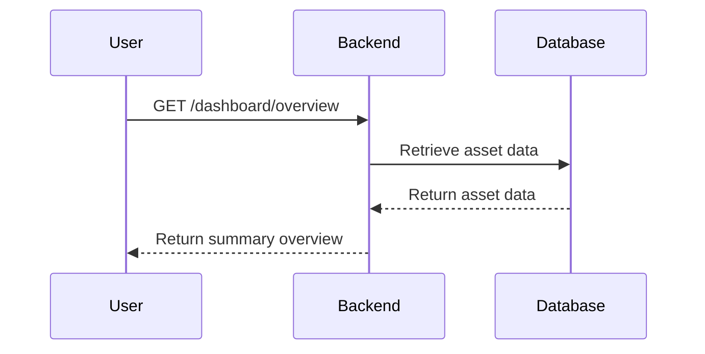

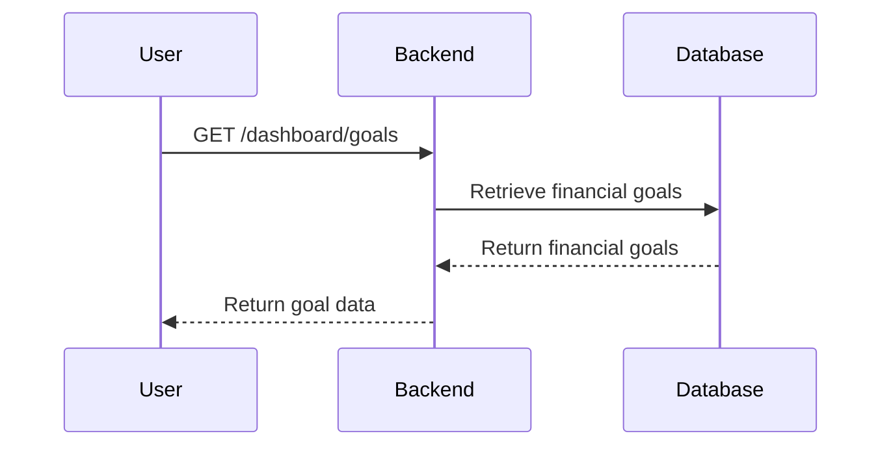

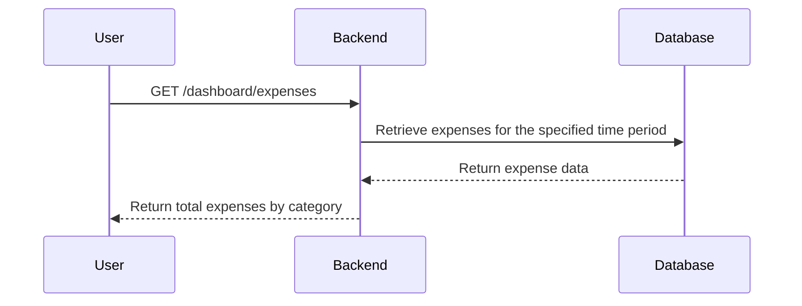

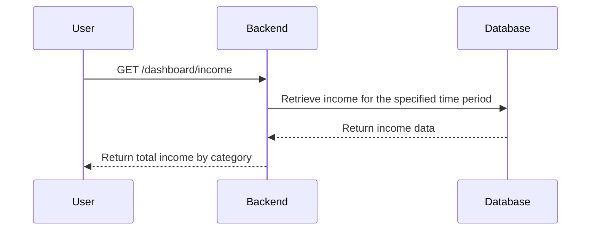

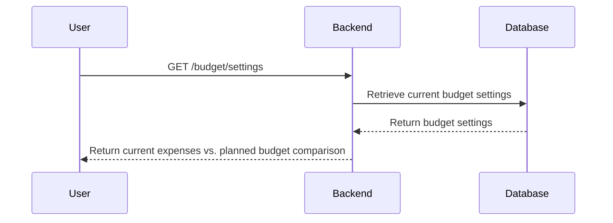

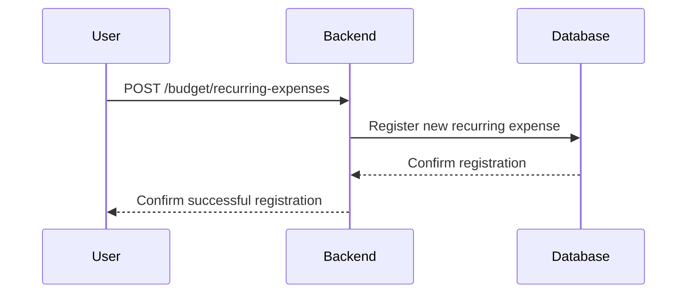

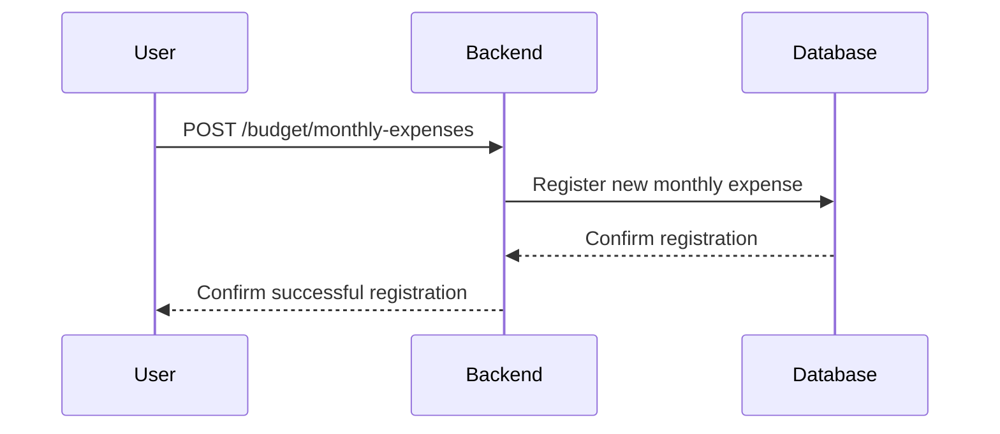

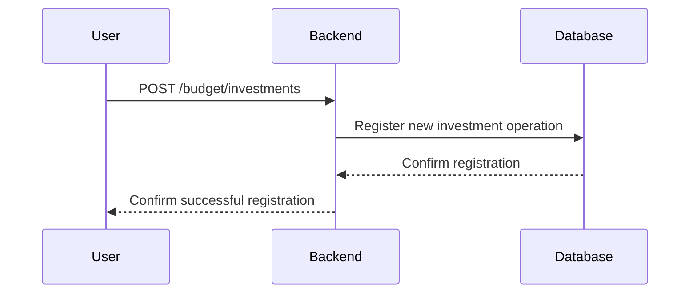

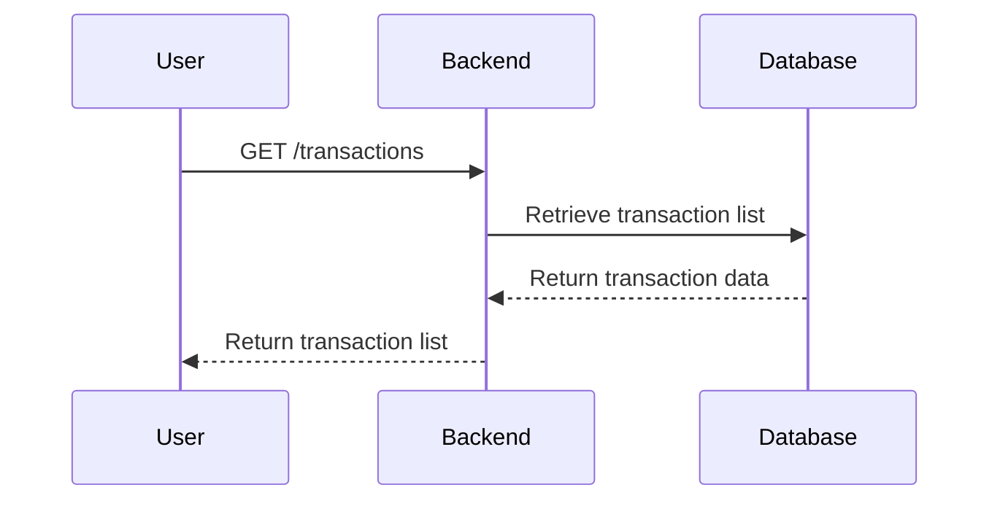

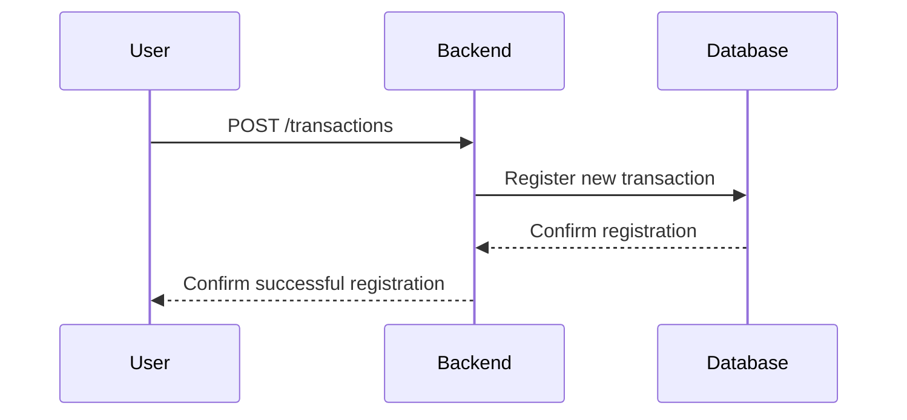

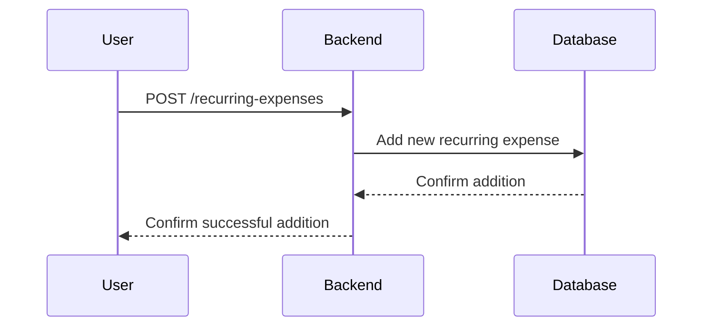

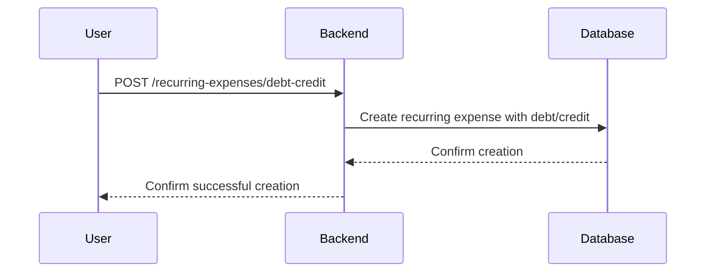

# Personal Finance Management System

The Personal Finance Management System is designed to assist users in tracking and managing their financial activities,
including assets, expenses, income, and investments. The backend provides RESTful APIs to retrieve and process financial
data, offering insights into various aspects of personal finance.

## Features

- **Comprehensive Financial Overview**: Offers real-time data on assets, expenses, income, and investment performance.
- **Budget Management**: Includes tools for analyzing spending patterns and projecting financial sustainability.
- **Investment Tracking**: Provides automatic updates on market conditions to monitor investment portfolios.
- **Recurring Expense Management**: Handles regular expenses with considerations for debt and credit management.
- **Customizable Financial Goals**: Allows users to set and monitor long-term financial objectives.

## Architecture

The system is structured with a focus on modularity and scalability, employing a microservices architecture. Each
service is responsible for a specific domain, such as user management, expense tracking, or investment analysis. The
services communicate via RESTful APIs, ensuring a decoupled and maintainable codebase.

## Technologies Used

- **Backend**: Developed using Java with the Quarkus framework, providing a responsive and efficient environment for
  building microservices.
- **Data Storage**: Utilizes PostgreSQL for robust and reliable data management.
- **Authentication**: Implements OAuth 2.0 for secure user authentication and authorization.
- **API Documentation**: Employs Swagger for comprehensive API documentation and testing.

## Getting Started

To set up the project locally:

1. **Clone the Repository**:

```bash
git clone https://github.com/ffracas/personal-finance.git
```

## Running the application in dev mode

You can run your application in dev mode that enables live coding using:

```shell script
./mvnw quarkus:dev
```

## Swagger documentation

You can see the swagger documentation on the next url

```bash
http://localhost:8585/q/swagger-ui/
```

> **_NOTE:_**  Quarkus now ships with a Dev UI, which is available in dev mode only at <http://localhost:8080/q/dev/>.

## Packaging and running the application

The application can be packaged using:

```shell script
./mvnw package
```

It produces the `quarkus-run.jar` file in the `target/quarkus-app/` directory.
Be aware that it’s not an _über-jar_ as the dependencies are copied into the `target/quarkus-app/lib/` directory.

The application is now runnable using `java -jar target/quarkus-app/quarkus-run.jar`.

If you want to build an _über-jar_, execute the following command:

```shell script
./mvnw package -Dquarkus.package.jar.type=uber-jar
```

The application, packaged as an _über-jar_, is now runnable using `java -jar target/*-runner.jar`.

## Creating a native executable

You can create a native executable using:

```shell script
./mvnw package -Dnative
```

Or, if you don't have GraalVM installed, you can run the native executable build in a container using:

```shell script
./mvnw package -Dnative -Dquarkus.native.container-build=true
```

You can then execute your native executable with: `./target/personal-finance-1.0-SNAPSHOT-runner`

If you want to learn more about building native executables, please consult <https://quarkus.io/guides/maven-tooling>.

## Related Guides

- Mutiny ([guide](https://quarkus.io/guides/mutiny-primer)): Write reactive applications with the modern Reactive
  Programming library Mutiny
- REST ([guide](https://quarkus.io/guides/rest)): A Jakarta REST implementation utilizing build time processing and
  Vert.x. This extension is not compatible with the quarkus-resteasy extension, or any of the extensions that depend on
  it.
- Reactive MySQL client ([guide](https://quarkus.io/guides/reactive-sql-clients)): Connect to the MySQL database using
  the reactive pattern

## Provided Code

### REST

Easily start your REST Web Services

[Related guide section...](https://quarkus.io/guides/getting-started-reactive#reactive-jax-rs-resources)

